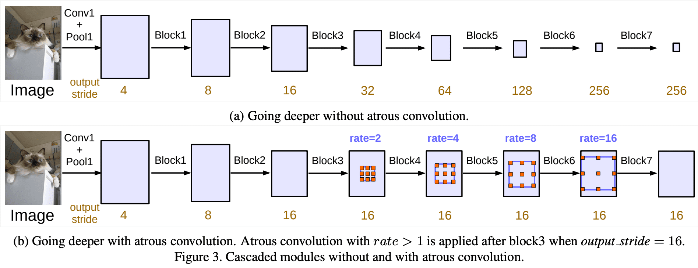
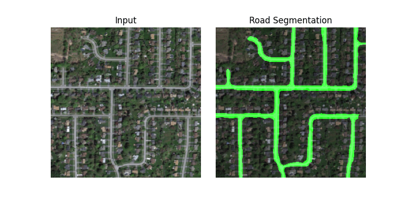

# SenseTheRoad: Road Detection Image Segmentation

This repository presents a semantic segmentation in the realm of road detection from satellite imagery, using the power of the state-of-the-art DeepLabv3 segmentation model to precisely identify and delineate roads in these images.

## Dataset

In this project, we leveraged the *Road Detection: Remote Sensing Satellite Imagery* dataset for training and validating our segmentation model. This comprehensive dataset comprises 224 high-resolution satellite images, each accompanied by its corresponding masks, providing the essential foundation for our model's development and evaluation.

You can download the dataset from [here](https://www.kaggle.com/datasets/ipythonx/tgrs-road).

## Model Architecture

DeepLabv3 is a deep neural network architecture developed for tasks related to semantic segmentation. It utilizes Atrous (dilated) convolutions to control how the network perceives the image and manages feature map resolutions without increasing the overall number of parameters. Additionally, it features Atrous Spatial Pyramid Pooling, a technique that effectively gathers information at multiple scales, essential for segmentation. In essence, DeepLabv3 is proficient at capturing detailed feature maps with comprehensive long-range information, enabling accurate image segmentation.

## Results

We conducted a comprehensive evaluation of our model, employing two evaluation metrics: *Pixel Accuracy* and *Mean Intersection over Union (IoU)*. Our model demonstrated impressive performance, achieving a remarkable **93.74% pixel accuracy** and a **mean Intersection over Union score of 70.68%**. In the visual representation provided below, you can observe the segmentation of the road.

## References
L.-C. Chen, G. Papandreou, F. Schroff, and H. Adam, *‘Rethinking Atrous Convolution for Semantic Image Segmentation’*, CoRR, vol. abs/1706.05587, 2017. [Paper](http://arxiv.org/abs/1706.05587)

DeepLabv3 - Building Blocks for Robust Segmentation Models, Isaac Berrios. [Webpage](https://medium.com/@itberrios6/deeplabv3-c0c8c93d25a4)
